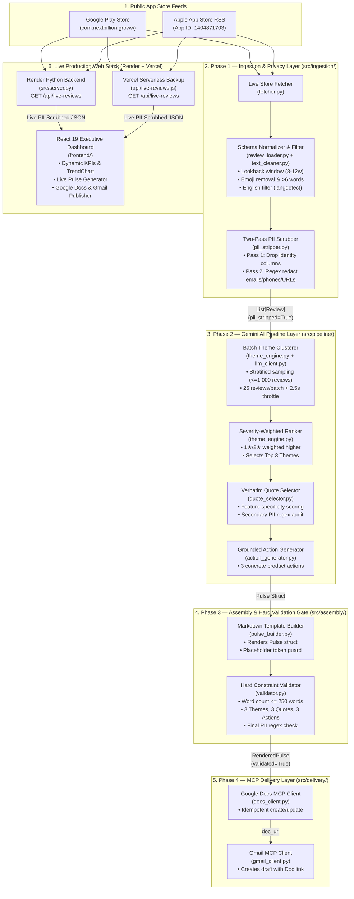
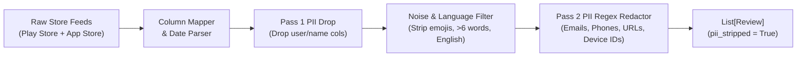
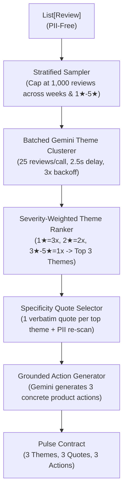
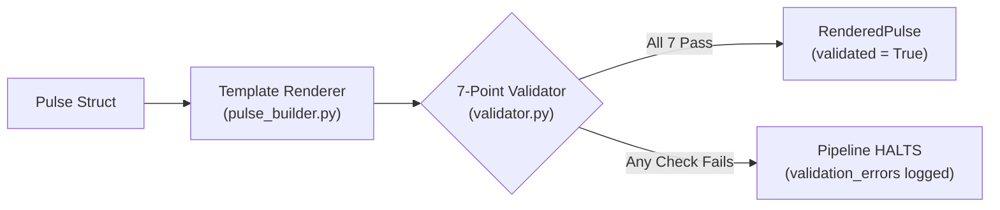
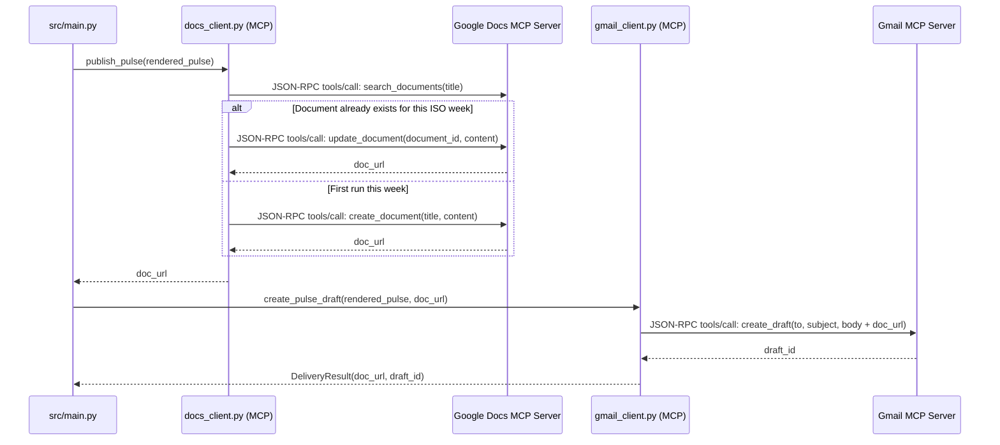
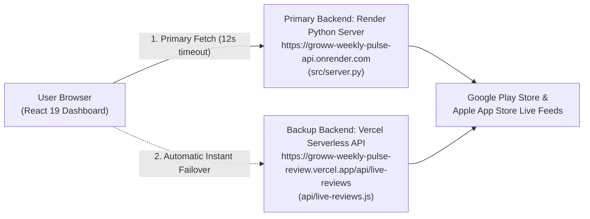

# Groww Weekly Pulse Review 📈

An end-to-end **AI Customer Feedback Intelligence Engine**, **MCP-Driven Executive Reporting Pipeline**, and **Interactive React 19 Analytics Dashboard** built for **Groww**.

The system automatically ingests live public reviews from the **Google Play Store** (`com.nextbillion.groww`) and **Apple App Store** (`1404871703`), enforces **Privacy-by-Design** through two-pass PII scrubbing at ingestion, clusters and ranks user friction themes using **Google Gemini (`google-genai`)**, selects verbatim user quotes, generates grounded engineering action items, validates a strict **`≤ 250` word executive readability constraint**, and delivers weekly pulses to **Google Docs** and **Gmail** via **Model Context Protocol (MCP)** servers alongside a live production web application.

---

## 🔗 Live Production URLs & Resources

| Resource | Live URL |
| :--- | :--- |
| **🌐 Live Production Dashboard (Vercel)** | **[https://groww-weekly-pulse-review.vercel.app](https://groww-weekly-pulse-review.vercel.app)** |
| **🐍 Live Python Backend API (Render)** | **[https://groww-weekly-pulse-api.onrender.com/api/live-reviews](https://groww-weekly-pulse-api.onrender.com/api/live-reviews)** |
| **🩺 Render Backend Health Check** | **[https://groww-weekly-pulse-api.onrender.com/health](https://groww-weekly-pulse-api.onrender.com/health)** |
| **⚡ Live Serverless Backup API (Vercel)** | **[https://groww-weekly-pulse-review.vercel.app/api/live-reviews](https://groww-weekly-pulse-review.vercel.app/api/live-reviews)** |
| **📝 Live Google Doc Deliverable** | **[https://docs.google.com/document/d/1EBODRQUvYK5oBVDrdKmIhqGB9EOwIz0qCFLQNdpPh3s/edit](https://docs.google.com/document/d/1EBODRQUvYK5oBVDrdKmIhqGB9EOwIz0qCFLQNdpPh3s/edit)** |
| **💻 GitHub Repository** | **[https://github.com/prathmeshmdeshmane001/groww-weekly-pulse-review](https://github.com/prathmeshmdeshmane001/groww-weekly-pulse-review)** |
| **📄 Problem Statement** | [docs/ProblemStatement.md](./docs/ProblemStatement.md) |
| **🏗️ System Architecture** | [docs/architecture.md](./docs/architecture.md) |
| **📋 Implementation Plan** | [docs/implementation-plan.md](./docs/implementation-plan.md) |
| **✅ Evaluation Plan** | [docs/eval.md](./docs/eval.md) |


---

## 🎯 Problem Statement & Executive Summary

### The Challenge: Signal Extraction from Noisy Store Feeds
App Store and Google Play Store reviews are publicly accessible, but high-growth fintech apps receive thousands of unstructured reviews every week. Product, growth, customer support, and leadership teams struggle with **signal extraction**:
* **Raw volume drowns out recurring bugs**: Critical issues (such as Aadhaar OTP timeouts during KYC, UPI mandate failures during morning market open, or candlestick chart lag at 9:15 AM IST) get buried under one-word ratings and generic praise.
* **Privacy & compliance risk**: Raw user reviews frequently contain personal phone numbers, email addresses, bank references, or user IDs that must **never** be forwarded to third-party LLMs or pasted into shared company documents.
* **Executive fatigue**: Long, multi-page feedback reports go unread. Stakeholders need a scannable, **one-page weekly pulse (`≤ 250 words`)** delivered directly where they already work—**Google Docs** and **Gmail**.

### Who This System Helps
| Stakeholder Group | Pain Point Solved |
| :--- | :--- |
| **Product & Engineering Teams** | Prioritize the highest-severity friction clusters (`Charges & Fees`, `App Performance`, `Payments`, `KYC & Onboarding`, `Withdrawals`, `Statements`, `Customer Support`) backed by verbatim user evidence and concrete action items. |
| **Customer Support Teams** | Align helpdesk macros, SLA routing, and chatbot escalation paths with the exact complaints spiking in the current week. |
| **Executive Leadership** | Scan a validated `≤ 250`-word weekly health check in under 2 minutes without sifting through raw review exports. |

### Non-Negotiable Architectural Constraints
1. **Public Store Feeds Only**: Ingests strictly public Google Play Store and Apple App Store reviews (`8–12` week configurable lookback window) without login-gated scraping.
2. **Privacy-First (Zero PII Leakage)**: Reviewer usernames, IDs, emails, phone numbers, URLs, and device identifiers are stripped at the **Ingestion Layer** before any review reaches the LLM or output artifacts.
3. **Bounded Theme Taxonomy**: Clusters reviews into core product themes and surfaces **at most 3 Top Themes** per weekly pulse, paired with **3 verbatim user quotes** and **3 grounded action ideas**.
4. **Hard `≤ 250` Word Ceiling**: Enforced as a strict validation gate (`src/assembly/validator.py`)—if a generated pulse exceeds 250 words or fails any structural check, the pipeline halts before delivery.
5. **MCP-Exclusive Google Workspace Delivery**: Application code makes **zero direct REST API calls** to Google Docs or Gmail. All document creation/updating and email draft generation happen exclusively through **Model Context Protocol (MCP)** JSON-RPC 2.0 servers.

---

## 🏗️ End-to-End System Architecture

The project combines two tightly integrated environments:
1. **A 4-Phase Autonomous Python AI Pipeline (`src/`)** for CLI orchestration, Gemini LLM clustering, hard constraint validation, and MCP server delivery.
2. **A Live Dual-Backend Production Web Application (`Render Python API` + `Vercel Serverless API` + `React 19 Frontend`)** for interactive exploration, on-demand live store ingestion, dynamic pulse generation, and one-click Google Docs / Gmail publishing.



---

## 🔬 Deep Dive: The 4-Phase Autonomous Python Pipeline (`src/`)

The core pipeline (`src/main.py`) follows a **strictly linear, forward-only contract architecture**. There is no shared mutable global state between phases; each phase consumes an immutable typed contract from the preceding phase and validates its own output before passing data forward.

---

### Phase 1 — Data Ingestion, Normalization & Two-Pass PII Scrubbing (`src/ingestion/`)

Phase 1 ingests raw store reviews, normalizes disparate store schemas into a single domain model, filters out noise, and guarantees that **zero personally identifiable information (PII)** leaves the ingestion boundary.



#### 1. Live Multi-Store Scraping (`src/ingestion/fetcher.py`)
* **Google Play Store (`fetch_play_store_reviews`)**: Uses `google-play-scraper` (`Sort.NEWEST`, `lang="en"`, `country="in"`) to fetch paginated batches of 200 reviews for `com.nextbillion.groww` until reaching the configured `lookback_weeks` cutoff.
* **Apple App Store (`fetch_app_store_reviews`)**: Queries Apple's public iTunes RSS Customer Reviews JSON endpoint (`https://itunes.apple.com/in/rss/customerreviews/page={1..10}/id=1404871703/sortby=mostrecent/json`) with resilient retry handling.

#### 2. Store Schema Normalization & Quality Filtering (`src/ingestion/review_loader.py`, `src/ingestion/text_cleaner.py`)
* **Column Mapping**: Maps store-specific CSV/JSON fields configured in `config/settings.yaml`:
  * Play Store: `Review ID` → `id`, `Star Rating` → `rating`, `Review` → `text`, `Review Submit Date and Time` → `date`.
  * App Store: `Review ID` → `id`, `Rating` → `rating`, `Title` → `title`, `Review Text` → `text`, `Review Date` → `date`.
* **Text Hygiene Pipeline**:
  1. **Emoji Removal (`remove_emojis`)**: Strips Unicode supplementary pictographs, emoticons, transport/map symbols, dingbats, and variation selectors so downstream word counts and LLM tokenization remain clean.
  2. **Minimum Signal Filter (`count_words > 6`)**: Discards low-signal reviews with 6 or fewer words (e.g., `"Good app"`, `"Nice"`, `"Worst app ever"`).
  3. **Language Verification (`is_english`)**: Uses `langdetect` to retain English reviews (`en`) so clustering prompts and executive quotes remain consistent.
  4. **Date Windowing**: Retains only reviews within `[latest_review_date - lookback_weeks, latest_review_date]`.
  5. **Minimum Volume Gate (`min_reviews_required: 30`)**: If fewer than 30 valid reviews survive filtering, raises `InsufficientDataError` and halts the pipeline cleanly.

#### 3. Two-Pass Privacy-by-Design PII Scrubbing (`src/ingestion/pii_stripper.py`)
* **Pass 1 — Structural Column Drop (`drop_pii_columns`)**: Immediately deletes `Reviewer Name`, `reviewer_name`, `display_name`, `user_id`, `reviewer_id`, `author`, and `Author` keys from raw dictionaries before `Review` instantiation.
* **Pass 2 — Deep Regex Redaction (`redact_pii_from_text`)**: Scans both `title` and `text` using compiled regular expressions:

| PII Category | Detection Pattern Summary | Replacement Token |
| :--- | :--- | :--- |
| **Email Addresses** | `[A-Za-z0-9._%+-]+@[A-Za-z0-9.-]+\.[A-Za-z]{2,}` | `[REDACTED]` |
| **Phone Numbers** | Indian (`+91`, 10-digit mobile) & international phone patterns | `[REDACTED]` |
| **Personal / Ticket URLs** | `https?://\S+` and `www\.\S+` | `[LINK]` |
| **Device Model Strings** | `Device:\s*[\w\s-]+`, `Model:\s*[\w\s-]+`, `iPhone\s*\d+[\w\s]*` | Removed (`""`) |

#### Phase 1 Output Contract (`Review` — `src/ingestion/models.py`)
```python
class Review(BaseModel):
    id: str
    source: Literal["app_store", "play_store"]
    rating: int = Field(ge=1, le=5)
    title: str | None = None
    text: str
    date: datetime
    pii_stripped: bool = True
```

---

### Phase 2 — Gemini AI Theme Clustering, Ranking, Quote Selection & Action Generation (`src/pipeline/`)

Phase 2 transforms the sanitized `list[Review]` into a structured `Pulse` object using the official **Google GenAI SDK (`google-genai`)**.



#### 1. Stratified Sampling & Rate-Limit Quota Budgeting (`src/pipeline/llm_client.py`, `src/pipeline/theme_engine.py`)
To process large multi-week datasets without hitting Gemini free/standard tier rate limits, the pipeline implements a deterministic **Quota Budget**:

| Quota Metric | API Tier Limit | Pipeline Target Budget | Safety Headroom |
| :--- | :--- | :--- | :--- |
| **Requests / Minute (RPM)** | `30 RPM` | `~12–15 RPM` (`2.5s` delay between calls) | **50% buffer** |
| **Tokens / Minute (TPM)** | `12,000 TPM` | `~8,400 TPM` (`25` reviews/batch × `~700` tokens) | **30% buffer** |
| **Requests / Day (RPD)** | `1,000 RPD` | `~42 RPD` (`40` cluster batches + `1` summary + `1` action) | **95.8% buffer** |
| **Tokens / Day (TPD)** | `100,000 TPD` | `~30,000 TPD` (for `1,000` reviews) | **70% buffer** |

* **Stratified Sampling (`max_reviews_to_process: 1000`)**: When more than 1,000 reviews are loaded, reviews are stratified across `(ISO_week, star_rating)` buckets so the 1,000-review sample preserves the exact temporal and sentiment distribution of the full dataset.
* **Resilient Retry Policy**: Uses `tenacity` exponential backoff (`max_retries: 3`) to gracefully recover from transient `429 RESOURCE_EXHAUSTED` or network timeouts.

#### 2. Severity-Weighted Theme Ranking (`src/pipeline/theme_engine.py`)
Each review is assigned to a single theme from the configured taxonomy (`onboarding`, `KYC`, `payments`, `statements`, `withdrawals` in CLI config; extended with `Charges & Fees`, `App Performance`, and `Customer Support` in the full-spectrum classifier) or `"other"`.
* If 100% of reviews fall into `"other"`, the engine raises `NoThemesDetectedError`.
* Themes are ranked by **severity-weighted volume** so high-pain `1★` and `2★` reviews surface above generic `5★` praise:
  $$\text{ThemeScore}(T) = \sum_{r \in T} w(\text{rating}_r), \quad \text{where } w(1\star) = 3.0,\; w(2\star) = 2.0,\; w(3\star..5\star) = 1.0$$
* The **Top 3 Themes** by $\text{ThemeScore}$ are selected, and concise 1–2 sentence theme summaries are generated.

#### 3. Verbatim Quote Selection (`src/pipeline/quote_selector.py`)
For each of the Top 3 themes, `quote_selector.py` selects **1 real, verbatim user quote** (never LLM-fabricated):
* **Candidate Scoring**:
  * Prefers critical/constructive reviews (`1★–2★`) with length between `25` and `240` characters (concise enough for the `≤ 250`-word budget, detailed enough to describe a concrete bug).
  * Rewards concrete product feature mentions (e.g., `"OTP"`, `"SIP"`, `"mandate"`, `"P&L"`, `"brokerage"`, `"chart"`, `"auto square off"`, `"ticket"`).
* **Secondary PII Audit**: Runs `contains_pii(quote)` on every candidate before selection. Any review containing residual PII patterns is disqualified.

#### 4. Grounded Action Generation (`src/pipeline/action_generator.py`)
Prompts Gemini (`prompts/action_prompt.txt`) with the Top 3 themes, their summaries, and the 3 selected verbatim quotes to produce **3 concrete, numbered product improvement actions** (`≤ 2 sentences` each, directly referencing the underlying user friction).

#### Phase 2 Output Contract (`Pulse` — `src/pipeline/models.py`)
```python
class ThemeSummary(BaseModel):
    name: str
    review_count: int
    summary: str

class Pulse(BaseModel):
    top_themes: list[ThemeSummary]  # Exactly 3
    quotes: list[str]               # Exactly 3 verbatim, PII-clean quotes
    action_ideas: list[str]         # Exactly 3 concrete action items
    review_count: int
    week_of: date
```

---

### Phase 3 — Markdown Assembly & Hard Constraint Validation Gate (`src/assembly/`)

Phase 3 renders the `Pulse` object into a standardized executive brief and enforces a **7-point hard validation gate** before any external delivery can occur.



#### 1. Executive Markdown Template (`src/assembly/pulse_builder.py`)
Renders the pulse into a clean, scannable Markdown document and verifies that zero unfilled `{placeholder}` tokens remain:
```markdown
# Weekly Pulse - Groww App
Week of: {week_of}   |   Reviews analysed: {review_count}

## Top Themes This Week
1. **{theme_1}** ({count_1} reviews) - {theme_1_summary}
2. **{theme_2}** ({count_2} reviews) - {theme_2_summary}
3. **{theme_3}** ({count_3} reviews) - {theme_3_summary}

## What Users Are Saying
> "{quote_1}"
> "{quote_2}"
> "{quote_3}"

## Recommended Actions
1. {action_1}
2. {action_2}
3. {action_3}
```

#### 2. The 7-Point Hard-Stop Validator (`src/assembly/validator.py`)
Every generated pulse must pass all 7 assertions or `validated` is set to `False` and the pipeline halts:

| Check # | Validation Rule | Failure Behavior |
| :---: | :--- | :--- |
| **1** | **Word Count Ceiling**: `word_count <= 250` (configurable via `pulse.max_words`) | Halts pipeline; logs exact word count excess |
| **2** | **Theme Count**: `len(top_themes) == 3` | Halts pipeline; populates `validation_errors` |
| **3** | **Quote Count**: `len(quotes) == 3` | Halts pipeline; populates `validation_errors` |
| **4** | **Action Count**: `len(action_ideas) == 3` | Halts pipeline; populates `validation_errors` |
| **5** | **Minimum Quote Length**: Every quote has `len(quote.strip()) > 10` | Halts pipeline; flags short/empty quote |
| **6** | **Zero Residual PII**: `contains_pii(quote) is False` for all 3 quotes | Halts pipeline; identifies offending quote index |
| **7** | **Template Integrity**: No literal `{placeholder}` tokens in `markdown_text` | Halts pipeline; prevents broken template delivery |

---

### Phase 4 — MCP-Exclusive Delivery to Google Docs & Gmail (`src/delivery/`)

Phase 4 delivers a validated `RenderedPulse` to **Google Docs** and **Gmail** exclusively through **Model Context Protocol (MCP)** stdio servers (`src/delivery/mcp.py`). Application code never touches OAuth tokens, Google REST endpoints, or credential refresh flows.



* **Idempotent Google Docs Publishing (`src/delivery/docs_client.py`)**:
  * Formats the weekly document title as `"Weekly Pulse - Groww App | {year}-W{week}"`.
  * Searches via MCP if the document for that ISO week already exists. If found, calls `update_document` (preventing duplicate files on re-runs); otherwise calls `create_document`.
* **Sequenced Gmail Draft Creation (`src/delivery/gmail_client.py`)**:
  * Executes **strictly after** Google Docs publishing succeeds. If Google Docs fails, the Gmail step is skipped so a draft is never created with a missing or broken document link.

---

## 🌐 Live Dual-Backend Production Web Architecture (`Render` + `Vercel`)

In addition to the CLI pipeline, the project is deployed as a full-stack web application featuring a **Dual-Backend Live Review Ingestion Architecture**:



### 1. Dedicated Python Backend Server on Render (`src/server.py` + `render.yaml`)
* Runs a multi-threaded Python HTTP server (`ThreadingHTTPServer`) executing the real Python ingestion modules (`src/ingestion/fetcher.py`, `src/ingestion/pii_stripper.py`, `src/ingestion/text_cleaner.py`).
* **Endpoints**:
  * `GET /health` — Returns service health status, UTC timestamp, and active endpoints (`200 OK`).
  * `GET /api/live-reviews?weeks=10&batches=2` — Scrapes live Google Play Store & Apple App Store reviews in real time, strips emojis and PII, classifies each review into one of the 8 dashboard theme clusters, and returns normalized JSON with CORS enabled (`Access-Control-Allow-Origin: *`).

### 2. High-Availability Vercel Serverless Fallback (`api/live-reviews.js`)
* Deployed alongside the frontend on Vercel (`/api/live-reviews`).
* In `frontend/src/services/pulseService.ts` (`fetchLiveReviewsFromStores`), the frontend queries the **Render Python Backend** first (`VITE_API_BASE_URL`). If Render's free tier is sleeping after inactivity, the request automatically fails over to `/api/live-reviews` on Vercel so live review ingestion never fails or hangs.

### 3. Interactive Executive Dashboard Capabilities (`frontend/`)
* **Automatic Startup Sync & On-Demand Live Ingestion**:
  * Automatically fetches the latest live store reviews on startup and whenever the user clicks **"Generate New Pulse"** or **"Download Reviews"**, deduplicating by review ID (`mergeDeduplicatedReviews`) and merging into the `2,041+` review dataset.
* **Dynamic Date Horizon & Platform Filtering (`src/utils/analytics.ts`)**:
  * Filter analytics across **All Time**, **Latest Week**, **Last 7 / 14 / 30 / 60 / 90 Days**, or a **Custom Date Range**, and segment by **All Sources**, **Play Store**, or **App Store**.
* **Dynamic Dual-Axis Trend Chart (`src/components/dashboard/TrendChart.tsx`)**:
  * Computes 6 chronological intervals anchored to the latest review date in the active filter (`Aug 24` → `Sep 28`), dynamically scaling both the `Total reviews` bar axis and the `Negative %` line axis.
* **Interactive Pulse Generator with Window Selector (`src/components/pulse/GeneratePulseModal.tsx`)**:
  * Lets users choose the exact analysis window (**Current Week**, **Previous Week**, **Last 14 Days**, **Last 30 Days**, **Last 60 Days**, or **Full Dataset**), fetches live reviews, runs the 4-step synthesis pipeline, and updates the Weekly Pulses table and preview card with window-specific metrics, themes, quotes, and word count (`≤ 250 words`).
* **One-Click Google Docs & Gmail Publishing (`src/services/publishingService.ts`)**:
  * **"Publish to Google Docs"** / **"Open Google Doc"** opens the live Google Doc deliverable ([View Document](https://docs.google.com/document/d/1EBODRQUvYK5oBVDrdKmIhqGB9EOwIz0qCFLQNdpPh3s/edit)).
  * **"Send Email Draft"** / **"Open Gmail Draft"** opens Gmail Compose (`mail.google.com/mail/?view=cm&fs=1...`) pre-populated with the recipient email, week-specific subject line, full formatted Weekly Pulse report body, and Google Doc link.

---

## 📂 Complete Project Directory Structure

```text
groww-weekly-pulse-review/
├── api/
│   └── live-reviews.js                     # Vercel Serverless API for real-time App/Play Store ingestion
├── assets/
│   └── frontend.png                        # Dashboard UI preview screenshot
├── config/
│   └── settings.yaml                       # Runtime config (lookback, themes, LLM, word limits, delivery)
├── data/
│   ├── raw/                                # Raw App Store & Play Store CSV exports
│   │   ├── app_store_reviews.csv
│   │   └── play_store_reviews.csv
│   └── processed/
│       └── reviews.json                    # Normalized, PII-scrubbed reviews output by Phase 1
├── docs/
│   ├── ProblemStatement.md                 # Milestone problem statement & constraints
│   ├── architecture.md                     # Detailed 4-layer architecture & data contracts
│   ├── decision.md                         # Architectural decision records (ADRs)
│   ├── eval.md                             # Phase-by-phase evaluation & exit criteria
│   └── implementation-plan.md              # Phased implementation guide
├── frontend/                               # React 19 + TypeScript + Vite 8 + Tailwind CSS UI
│   ├── public/
│   ├── src/
│   │   ├── components/
│   │   │   ├── dashboard/                  # MetricCard, TrendChart, TopThemesTable, PulsePreviewCard, RatingDistribution
│   │   │   ├── layout/                     # Sidebar, Topbar, CommandPalette (Cmd+K)
│   │   │   ├── profile/                    # OnboardingModal & ProfileModal
│   │   │   ├── pulse/                      # GeneratePulseModal & DownloadReviewsModal
│   │   │   ├── reviews/                    # ReviewDrawer slide-over
│   │   │   ├── themes/                     # ThemeDrawer slide-over
│   │   │   └── ui/                         # Badge, Toast notifications
│   │   ├── data/
│   │   │   └── mockData.ts                 # 2,041 real ingested reviews exported from pipeline
│   │   ├── pages/                          # Overview, WeeklyPulses, PulseDetail, Reviews, Themes, Insights, DataSources, Settings
│   │   ├── services/                       # pulseService, reviewService, themeService, publishingService
│   │   ├── types/                          # TypeScript interfaces (Pulse, Review, Theme, Metric, etc.)
│   │   ├── utils/
│   │   │   └── analytics.ts                # Reactive date filtering & real-time KPI/theme/trend aggregation
│   │   ├── App.tsx                         # Root state, live sync, modal & route orchestration
│   │   └── main.tsx
│   ├── package.json
│   └── vite.config.ts
├── prompts/
│   ├── cluster_prompt.txt                  # Gemini prompt template for batch theme classification
│   └── action_prompt.txt                   # Gemini prompt template for grounded action generation
├── scripts/
│   ├── download_reviews.py                 # Standalone CLI to scrape App Store & Play Store reviews
│   └── export_real_data_for_frontend.py    # Exports ingested CSV dataset into frontend/src/data/mockData.ts
├── src/                                    # Python backend & 4-phase AI pipeline
│   ├── ingestion/
│   │   ├── fetcher.py                      # Live Play Store & App Store scrapers
│   │   ├── models.py                       # Pydantic Review contract
│   │   ├── pii_stripper.py                 # Two-pass PII column dropper & regex redactor
│   │   ├── review_loader.py                # CSV/JSON loader, schema normalizer, date filter
│   │   └── text_cleaner.py                 # Emoji stripper, word counter, English detector
│   ├── pipeline/
│   │   ├── action_generator.py             # Grounded 3-action generator via Gemini
│   │   ├── llm_client.py                   # Google GenAI SDK wrapper with throttling & retries
│   │   ├── models.py                       # ThemeSummary & Pulse contracts
│   │   ├── quote_selector.py               # Specificity-scored verbatim quote selector
│   │   └── theme_engine.py                 # Stratified sampler, batch clusterer, severity ranker
│   ├── assembly/
│   │   ├── models.py                       # RenderedPulse contract
│   │   ├── pulse_builder.py                # Markdown template renderer & placeholder guard
│   │   └── validator.py                    # 7-point hard constraint validator (<=250 words)
│   ├── delivery/
│   │   ├── docs_client.py                  # Idempotent Google Docs publisher via MCP
│   │   ├── gmail_client.py                 # Gmail draft creator via MCP
│   │   ├── mcp.py                          # JSON-RPC 2.0 stdio MCP client transport
│   │   └── models.py                       # DeliveryResult contract
│   ├── config.py                           # Pydantic settings loader for config/settings.yaml
│   ├── exceptions.py                       # Custom pipeline exceptions
│   ├── main.py                             # CLI phase orchestrator (--phase 1..4)
│   └── server.py                           # Production HTTP API Server for Render (/health, /api/live-reviews)
├── tests/                                  # 57 unit & integration tests (pytest)
│   ├── fixtures/
│   ├── test_ingestion.py                   # 17 tests for Phase 1
│   ├── test_pipeline.py                    # 14 tests for Phase 2
│   ├── test_assembly.py                    # 15 tests for Phase 3
│   └── test_delivery.py                    # 11 tests for Phase 4
├── .env.example                            # Template for local CLI environment variables
├── pyproject.toml                          # Python project metadata & pytest config
├── render.yaml                             # Render Blueprint config for Python Backend Web Service
├── requirements.txt                        # Python dependencies
└── vercel.json                             # Vercel production build & SPA routing config
```

---

## ⚙️ Configuration & Environment Variables

### 1. Runtime Pipeline Configuration (`config/settings.yaml`)
All pipeline thresholds, theme taxonomies, Gemini parameters, and word limits are externally configurable in `config/settings.yaml`:

```yaml
ingestion:
  lookback_weeks: 10
  sources:
    - app_store
    - play_store
  min_reviews_required: 30

themes:
  allowed:
    - onboarding
    - KYC
    - payments
    - statements
    - withdrawals
  max_themes: 5
  top_n_to_surface: 3

llm:
  model: "gemini-3.6-flash"
  temperature: 0.3
  max_output_tokens: 512
  batch_size: 25
  request_delay_seconds: 2.5
  max_retries: 3
  max_reviews_to_process: 1000

pulse:
  max_words: 250
  quotes_required: 3
  actions_required: 3

delivery:
  recipient_email: "team@groww.in"
  doc_title_format: "Weekly Pulse - Groww App | {year}-W{week}"
  draft_subject_format: "Weekly Pulse - Groww App | Week of {week_date}"
```

### 2. Environment Variables

| Variable | Where Used | Description |
| :--- | :--- | :--- |
| `VITE_API_BASE_URL` | **Vercel Frontend** | Set to `https://groww-weekly-pulse-api.onrender.com`. Routes live store ingestion requests to the Render Python backend first with automatic fallback to `/api/live-reviews` on Vercel. |
| `PORT` | **Render Backend (`src/server.py`)** | HTTP listening port (defaults to `8000` locally; automatically set to `10000` by Render). |
| `GEMINI_API_KEY` / `GOOGLE_API_KEY` | **Local CLI Phase 2 (`src/pipeline/`)** | Google Gemini API key for LLM batch theme clustering and action generation. |
| `MCP_GOOGLE_DOCS_CMD` | **Local CLI Phase 4 (`src/delivery/`)** | Command to launch the Google Docs MCP server over stdio. |
| `MCP_GMAIL_CMD` | **Local CLI Phase 4 (`src/delivery/`)** | Command to launch the Gmail MCP server over stdio. |

---

## 🛡️ Pipeline Failure Modes & Resiliency Matrix

| Failure Scenario | Layer | Exception / Detection | Recovery / Halt Behavior |
| :--- | :--- | :--- | :--- |
| **Raw export file missing** | Phase 1 (Ingestion) | `FileNotFoundError` | Logs missing file path and halts before processing. |
| **Malformed CSV row / invalid date** | Phase 1 (Ingestion) | Row-level parser guard | Skips malformed row with logged warning; continues ingesting valid rows. |
| **`< 30` reviews after filtering** | Phase 1 (Ingestion) | `InsufficientDataError` | Halts pipeline cleanly; prompts user to widen `--weeks` lookback window. |
| **Gemini API `429` / timeout** | Phase 2 (AI Pipeline) | `LLMQuotaError` / `tenacity` | Retries up to `3x` with exponential backoff + `2.5s` inter-batch throttling. |
| **All reviews classified as `"other"`** | Phase 2 (AI Pipeline) | `NoThemesDetectedError` | Halts pipeline; suggests updating theme taxonomy in `config/settings.yaml`. |
| **Pulse exceeds `250` words** | Phase 3 (Validation) | `RenderedPulse.validated = False` | Hard-stop gate blocks Phase 4 delivery; logs exact word count and errors. |
| **Residual PII detected in quote** | Phase 3 (Validation) | `contains_pii(quote) == True` | Hard-stop gate blocks delivery; logs offending quote index. |
| **Google Docs creation fails** | Phase 4 (Delivery) | `MCPToolError` / `MCPConnectionError` | Halts delivery immediately; skips Gmail draft creation so no broken link is sent. |
| **Render free tier cold-starting** | Web App (`pulseService.ts`) | `AbortController` (12s timeout) | Automatically fails over to Vercel Serverless `/api/live-reviews` with zero downtime. |

---

## 🚀 Getting Started Locally

### Prerequisites
* **Node.js** `18+` and `npm`
* **Python** `3.11+`

### 1. Run the Frontend Dashboard Locally
```bash
cd frontend
npm install
npm run dev
```
Open [http://localhost:5173/](http://localhost:5173/) in your browser.

To verify the production TypeScript & Vite bundle:
```bash
cd frontend
npm run build
```

### 2. Run the Python Backend API Server & Test Suite
```bash
# Create and activate virtual environment
python3 -m venv .venv
source .venv/bin/activate

# Install Python dependencies
pip install -r requirements.txt

# Start the live Python API server on http://localhost:8000
python src/server.py

# Run the full 57-test suite across all 4 pipeline phases
pytest tests/ -v
```

### 3. Run the CLI Pipeline (`src/main.py`)
```bash
# Download fresh reviews from Play Store & App Store (last 10 weeks) and run Phase 1
PYTHONPATH=src python src/main.py --download --weeks 10 --phase 1

# Run Phase 1 only on existing CSVs (Ingest, filter, and strip PII -> data/processed/reviews.json)
PYTHONPATH=src python src/main.py --phase 1

# Run through Phase 2 (Gemini AI clustering, severity ranking, quote & action generation)
PYTHONPATH=src python src/main.py --phase 2

# Run through Phase 3 (Markdown rendering & <= 250 word hard validation gate)
PYTHONPATH=src python src/main.py --phase 3

# Run full end-to-end pipeline through Phase 4 (Google Docs + Gmail MCP delivery)
PYTHONPATH=src python src/main.py --phase 4

# Re-export processed CSV reviews into the frontend TypeScript dataset (mockData.ts)
python scripts/export_real_data_for_frontend.py
```

---

## 📄 License
MIT License.
