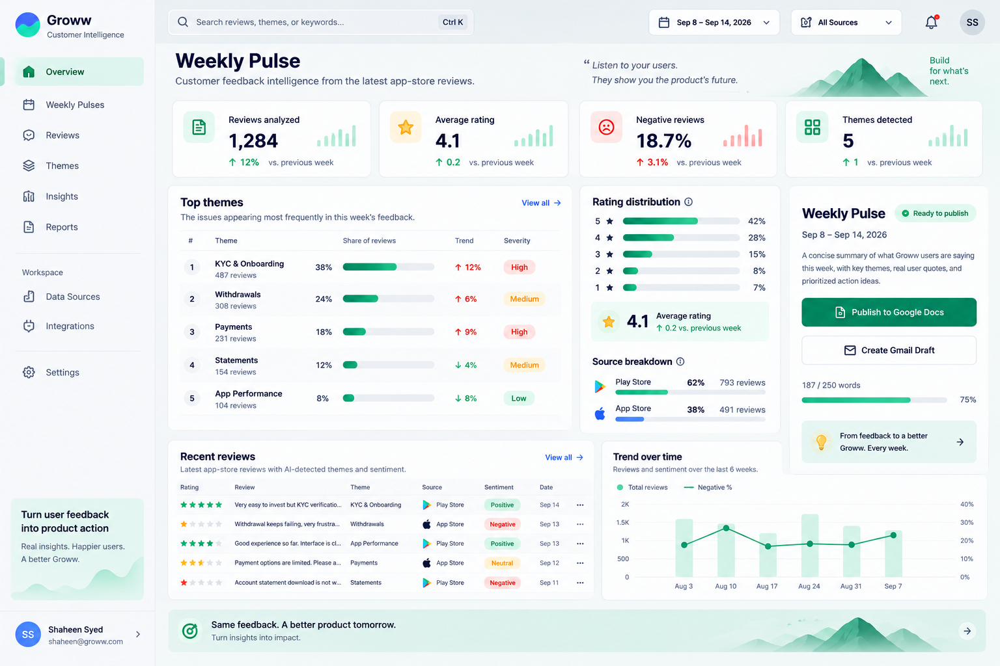
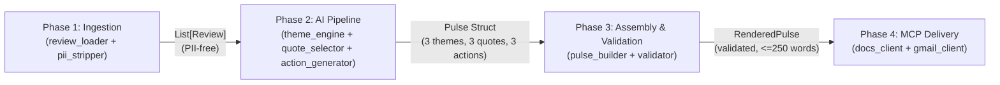

# Groww Weekly Pulse Review 📈

An automated AI customer feedback intelligence engine and executive dashboard for **Groww**. It ingests public Apple App Store and Google Play Store reviews, strips PII at ingestion, clusters friction themes and sentiment using Google Gemini, validates strict executive readability constraints (`≤ 250 words`), and delivers weekly pulses via **Google Docs** and **Gmail** (using Model Context Protocol servers) alongside an interactive **React 19 Executive Dashboard**.

---

## 🔗 Live Links & URLs

| Resource | URL |
| :--- | :--- |
| **🌐 Live Production Application (Vercel)** | **[https://groww-weekly-pulse-review.vercel.app](https://groww-weekly-pulse-review.vercel.app)** |
| **📝 Live Google Doc Deliverable** | **[https://docs.google.com/document/d/1EBODRQUvYK5oBVDrdKmIhqGB9EOwIz0qCFLQNdpPh3s/edit](https://docs.google.com/document/d/1EBODRQUvYK5oBVDrdKmIhqGB9EOwIz0qCFLQNdpPh3s/edit)** |
| **💻 GitHub Repository** | **[https://github.com/prathmeshmdeshmane001/groww-weekly-pulse-review](https://github.com/prathmeshmdeshmane001/groww-weekly-pulse-review)** |
| **📄 Problem Statement** | [docs/ProblemStatement.md](./docs/ProblemStatement.md) |
| **🏗️ System Architecture** | [docs/architecture.md](./docs/architecture.md) |
| **📋 Implementation Plan** | [docs/implementation-plan.md](./docs/implementation-plan.md) |
| **✅ Evaluation Plan** | [docs/eval.md](./docs/eval.md) |



---

## 🎯 Problem Statement & Project Overview

App Store and Google Play Store reviews are publicly accessible, but product, growth, support, and leadership teams struggle with **signal extraction**: sifting through thousands of noisy reviews to identify recurring product friction, quantify sentiment shifts, and prioritize high-impact engineering fixes.

**Groww Weekly Pulse Review** solves this through a two-part system:
1. **A 4-Phase Autonomous Python AI Pipeline (`src/`)**:
   - Scrapes and normalizes multi-store reviews (`com.nextbillion.groww` on Play Store and `1404871703` on App Store).
   - Enforces **Privacy-by-Design** by dropping reviewer identity columns and regex-redacting emails, phone numbers, URLs, and device IDs before any text reaches the LLM.
   - Clusters reviews into core product themes using **Google Gemini (`google-genai`)** with stratified sampling and rate-limit throttling.
   - Selects verbatim, feature-specific user quotes and generates concrete product action items.
   - Enforces a strict **250-word ceiling** and structural validation gate before publishing idempotently to **Google Docs** and creating a **Gmail draft** exclusively through **MCP (Model Context Protocol)** servers.
2. **An Interactive Executive Web Dashboard (`frontend/`)**:
   - Powered by **1,810 real ingested reviews** pre-exported from the pipeline into `frontend/src/data/mockData.ts`.
   - Provides real-time date-range filtering, theme deep-dives, sentiment trend charts, full-text review search, on-demand review ingestion simulation, interactive pulse generation, and one-click Google Docs / Gmail publishing previews.

---

## 🏗️ System Architecture & 4-Phase Pipeline

The backend pipeline (`src/main.py`) follows a strictly linear, forward-only contract architecture where each phase validates its output before passing data downstream:



### Phase 1 — Data Ingestion & Privacy Scrubbing (`src/ingestion/`)
* **Live Scrapers (`fetcher.py`)**: Downloads public reviews from Google Play Store (`google-play-scraper`) and Apple App Store (`iTunes RSS Customer Reviews JSON feed`) spanning a configurable lookback window (`8–12 weeks`).
* **Normalization & Filtering (`review_loader.py`, `text_cleaner.py`)**:
  * Maps store-specific CSV/JSON columns (`Star Rating` vs `Rating`, `Review` vs `Review Text`) via `config/settings.yaml`.
  * Strips Unicode emojis, filters out short low-signal reviews (`≤ 6 words`), and retains English-language reviews (`langdetect`).
  * Enforces a minimum threshold (`min_reviews_required: 30`), raising `InsufficientDataError` if unmet.
* **Two-Pass PII Stripping (`pii_stripper.py`)**:
  * **Pass 1 (Column Drop)**: Drops `Reviewer Name`, `reviewer_name`, `display_name`, `user_id`, and `reviewer_id` prior to normalization.
  * **Pass 2 (Regex Redaction)**: Redacts email addresses (`[REDACTED]`), phone numbers (`[REDACTED]`), personally identifying URLs (`[LINK]`), and device strings inside review text and titles. Sets `pii_stripped = True`.

### Phase 2 — AI Theme Clustering, Ranking & Action Generation (`src/pipeline/`)
* **Stratified Sampling & Quota Budgeting (`theme_engine.py`, `llm_client.py`)**:
  * Caps processing at `max_reviews_to_process: 1000` using stratified sampling across weeks and star ratings (`1★–5★`) to stay well within Gemini API rate limits (`30 RPM`, `12,000 TPM`, `100,000 TPD`).
  * Sends batches of `25` reviews per LLM call with a `2.5s` inter-batch delay and exponential backoff on `429 / RESOURCE_EXHAUSTED` responses.
* **Severity-Weighted Theme Ranking**:
  * Classifies reviews into configured themes (`onboarding`, `KYC`, `payments`, `statements`, `withdrawals`, plus extended dashboard clusters `Charges & Fees`, `App Performance`, `Customer Support`).
  * Ranks themes by weighting `1★–2★` reviews higher so critical user pain points surface in the **Top 3 Themes**.
* **Verbatim Quote Selection (`quote_selector.py`)**:
  * Scores candidate reviews per top theme by specificity (preferring concrete product feature mentions over generic complaints) and runs a secondary PII regex verification scan.
* **Grounded Action Generation (`action_generator.py`)**:
  * Prompts Gemini with the top 3 themes and verbatim quotes to produce **3 concrete, numbered product improvement actions** (`≤ 2 sentences` each).

### Phase 3 — Pulse Assembly & Hard Constraint Validation (`src/assembly/`)
* **Markdown Template Rendering (`pulse_builder.py`)**: Renders the `Pulse` struct into a clean executive brief and verifies no unfilled `{placeholder}` tokens remain.
* **Hard-Stop Validator (`validator.py`)**:
  * Total word count **must be `≤ 250 words`**.
  * Exactly **3 themes**, **3 verbatim quotes**, and **3 action ideas** must be present.
  * Every quote must be `> 10 characters` and pass a final PII regex audit.
  * If any check fails, `validated = False` and the pipeline halts before delivery.

### Phase 4 — MCP-Exclusive Delivery (`src/delivery/`)
* **Zero Direct REST Calls**: All Google Workspace calls go through JSON-RPC 2.0 stdio MCP servers (`src/delivery/mcp.py`).
* **Idempotent Google Docs Publishing (`docs_client.py`)**: Searches for an existing document matching `"Weekly Pulse - Groww App | {year}-W{week}"`. Calls `update_document` on re-runs or `create_document` on first run, returning the `doc_url`.
* **Gmail Draft Creation (`gmail_client.py`)**: Calls `create_draft` with the formatted subject, Markdown pulse body, and the published Google Doc URL.

---

## ✨ Executive Web Dashboard Features (`frontend/`)

* **📊 Dynamic KPI Overview**:
  * Real-time metrics for **Reviews Analyzed**, **Average Rating**, **Negative Review Proportion (1★ & 2★)**, and **Active Theme Clusters** with trend sparklines.
* **📅 Open-Ended Date Horizon & Source Filtering**:
  * Filter analytics reactively across **All Time**, **Latest Week**, **Last 7 / 14 / 30 / 60 / 90 Days**, or a **Custom Start/End Date Range**, as well as by platform (**All Sources**, **Play Store**, **App Store**).
* **🔥 Top Friction Themes & Deep-Dive Drawers**:
  * Ranked theme breakdown showing review volume, share percentage, severity badge (`High` / `Medium` / `Low`), week-over-week trend velocity, common complaints, and recommended product actions. Clicking any theme opens a slide-over drawer with filtered verbatim reviews.
* **💬 Live Reviews Explorer**:
  * Searchable, filterable table of all ingested reviews with star rating filters, sentiment badges (`Positive`, `Neutral`, `Negative`), theme tags, PII-sanitized verification badges, and full review detail drawers.
* **📥 On-Demand Review Downloader Modal**:
  * Interactive ingestion workflow supporting configurable lookback windows (`4` to `104` weeks) with step-by-step progress visualization across Play Store and App Store feeds.
* **⚡ AI Weekly Pulse Generator & Publisher**:
  * Interactive modal simulating the 4-step Gemini AI pipeline, producing a validated `< 250` word pulse report with one-click publishing to **Google Docs** and **Gmail Drafts**.
* **⌨️ Command Palette (`⌘K` / `Ctrl+K`) & User Onboarding**:
  * Quick keyboard navigation across all dashboard views, themes, and reviews, plus browser-persisted (`localStorage`) user profile customization.

---

## 📂 Project Directory Structure

```text
groww-weekly-pulse-review/
├── assets/
│   └── frontend.png                        # Dashboard UI preview screenshot
├── config/
│   └── settings.yaml                       # Runtime config (lookback, themes, LLM, word limits)
├── data/
│   ├── raw/                                # Raw App Store & Play Store CSV exports
│   │   ├── app_store_reviews.csv
│   │   └── play_store_reviews.csv
│   └── processed/
│       └── reviews.json                    # Normalized, PII-scrubbed reviews
├── docs/
│   ├── ProblemStatement.md                 # Milestone problem statement & constraints
│   ├── architecture.md                     # Detailed 4-layer architecture & data contracts
│   ├── decision.md                         # Architectural decision records
│   ├── eval.md                             # Phase-by-phase evaluation & exit criteria
│   └── implementation-plan.md              # Phased implementation guide
├── frontend/                               # React 19 + TypeScript + Vite + Tailwind CSS UI
│   ├── public/
│   ├── src/
│   │   ├── components/                     # Dashboard cards, modals, drawers, layout, UI primitives
│   │   ├── data/
│   │   │   └── mockData.ts                 # 1,810 real ingested reviews exported from pipeline
│   │   ├── pages/                          # Overview, Pulses, PulseDetail, Reviews, Themes, Insights, DataSources, Settings
│   │   ├── services/                       # Client services (pulse, review, theme, publishing)
│   │   ├── types/                          # TypeScript interfaces
│   │   ├── utils/
│   │   │   └── analytics.ts                # Reactive date filtering & real-time KPI/theme aggregation
│   │   ├── App.tsx
│   │   └── main.tsx
│   ├── package.json
│   └── vite.config.ts
├── prompts/
│   ├── cluster_prompt.txt                  # LLM prompt template for batch theme classification
│   └── action_prompt.txt                   # LLM prompt template for grounded action generation
├── scripts/
│   ├── download_reviews.py                 # Standalone CLI to scrape App Store & Play Store reviews
│   └── export_real_data_for_frontend.py    # Exports ingested CSV data into frontend/src/data/mockData.ts
├── src/                                    # Python backend & AI pipeline
│   ├── ingestion/                          # CSV/JSON loader, live fetcher, PII stripper, text cleaner
│   ├── pipeline/                           # Gemini client, theme engine, quote selector, action generator
│   ├── assembly/                           # Markdown pulse builder & 250-word hard validator
│   ├── delivery/                           # MCP JSON-RPC client, Google Docs & Gmail connectors
│   ├── config.py                           # Pydantic settings loader
│   ├── exceptions.py                       # Custom pipeline exceptions
│   └── main.py                             # CLI phase orchestrator (--phase 1..4)
├── tests/                                  # 57 unit & integration tests (pytest)
│   ├── fixtures/
│   ├── test_ingestion.py
│   ├── test_pipeline.py
│   ├── test_assembly.py
│   └── test_delivery.py
├── .env.example                            # Template for local CLI environment variables
├── pyproject.toml                          # Python project metadata & pytest config
├── requirements.txt                        # Python dependencies
└── vercel.json                             # Vercel production build & SPA routing config
```

---

## 🛠️ Tech Stack & Storage

| Layer | Technology |
| :--- | :--- |
| **Frontend** | React 19, TypeScript ~6.0, Vite 8, Tailwind CSS 3.4, Lucide Icons |
| **Backend / AI Pipeline** | Python 3.11+, Google GenAI SDK (`google-genai`), Pydantic v2, PyYAML |
| **Data Ingestion** | `google-play-scraper`, Apple iTunes RSS JSON Feed, `langdetect` |
| **External Delivery** | Model Context Protocol (MCP) JSON-RPC 2.0 (`Google Docs MCP`, `Gmail MCP`) |
| **Database / Data Store** | File-based CSV/JSON (`data/raw/*.csv`, `data/processed/reviews.json`) exported to static TypeScript bundle (`frontend/src/data/mockData.ts`) + Browser `localStorage` |
| **Testing** | `pytest` (57 unit and integration tests across all 4 phases) |
| **Deployment** | Vercel (`vercel.json` configured for automated Git builds) |

---

## ⚙️ Environment Variables

### 1. Frontend (Vercel Production)
* **No environment variables are required** on Vercel. The React dashboard runs out-of-the-box using the pre-exported dataset in `frontend/src/data/mockData.ts`.

### 2. Local Python CLI Pipeline (`.env` — Optional)
To run Phases 2–4 of the Python CLI pipeline (`src/main.py`) locally with live Gemini LLM calls and local MCP servers, copy `.env.example` to `.env`:

```bash
cp .env.example .env
```

| Variable | Description | Required For |
| :--- | :--- | :--- |
| `GEMINI_API_KEY` / `GOOGLE_API_KEY` | Google Gemini API key for theme clustering & action generation | Phase 2 (`src/pipeline/llm_client.py`) |
| `MCP_GOOGLE_DOCS_CMD` | Executable path/command for the Google Docs MCP server | Phase 4 (`src/delivery/docs_client.py`) |
| `MCP_GMAIL_CMD` | Executable path/command for the Gmail MCP server | Phase 4 (`src/delivery/gmail_client.py`) |

---

## 🚀 Getting Started Locally

### Prerequisites
* **Node.js** 18+ and `npm`
* **Python** 3.11+

### 1. Run the Frontend Dashboard
```bash
cd frontend
npm install
npm run dev
```
Open [http://localhost:5173/](http://localhost:5173/) in your browser.

To create a production build locally:
```bash
cd frontend
npm run build
```

### 2. Run the Python Backend Pipeline & Tests
```bash
# Create and activate virtual environment
python3 -m venv .venv
source .venv/bin/activate

# Install dependencies
pip install -r requirements.txt

# Run the full 57-test suite
pytest tests/ -v
```

#### CLI Pipeline Usage (`src/main.py`)
```bash
# Run Phase 1 only (Ingest, filter, and strip PII from data/raw/*.csv)
PYTHONPATH=src python src/main.py --phase 1

# Download fresh reviews (last 12 weeks) and run Phase 1
PYTHONPATH=src python src/main.py --download --weeks 12 --phase 1

# Run through Phase 2 (Gemini AI clustering & quote/action generation)
PYTHONPATH=src python src/main.py --phase 2

# Run through Phase 3 (Markdown rendering & <=250 word validation)
PYTHONPATH=src python src/main.py --phase 3

# Run full end-to-end pipeline through Phase 4 (Google Docs + Gmail MCP delivery)
PYTHONPATH=src python src/main.py --phase 4

# Export ingested CSV dataset to frontend TypeScript bundle
python scripts/export_real_data_for_frontend.py
```

---

## 🌐 Deployment (Vercel)

This project is deployed on **Vercel** and connected to GitHub for automatic deployments on every push to `main`:

* **Production URL**: [https://groww-weekly-pulse-review.vercel.app](https://groww-weekly-pulse-review.vercel.app)
* **Install Command**: `cd frontend && npm install`
* **Build Command**: `cd frontend && npm run build`
* **Output Directory**: `frontend/dist`
* **Framework Preset**: `vite`

---

## 📄 License
MIT License.
