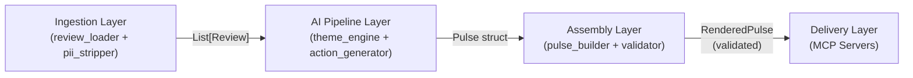
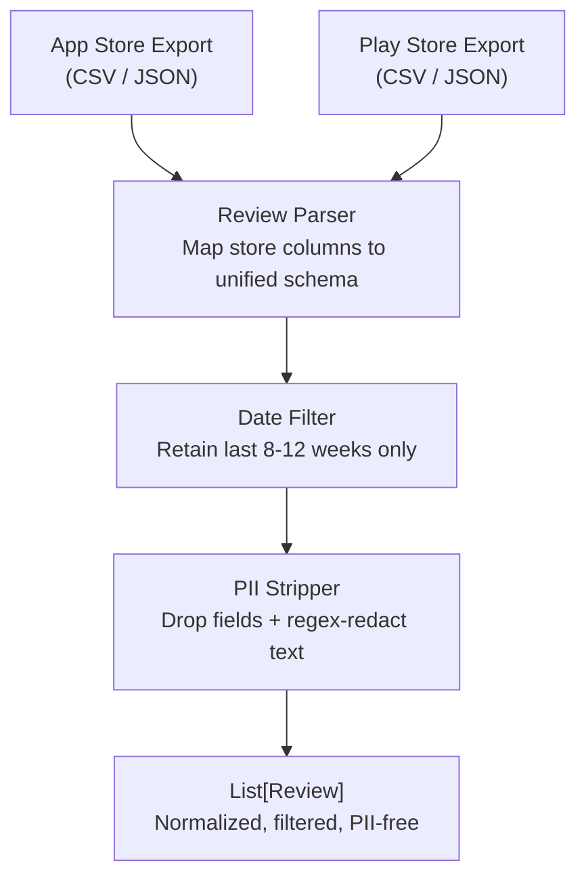
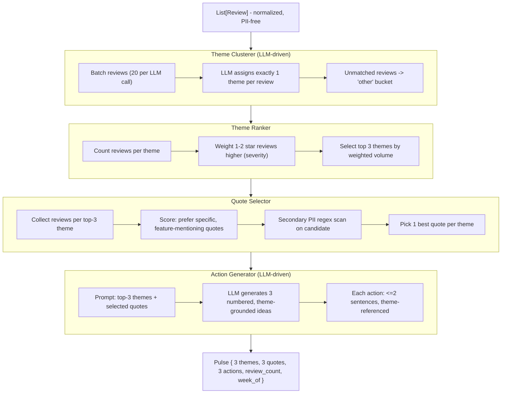
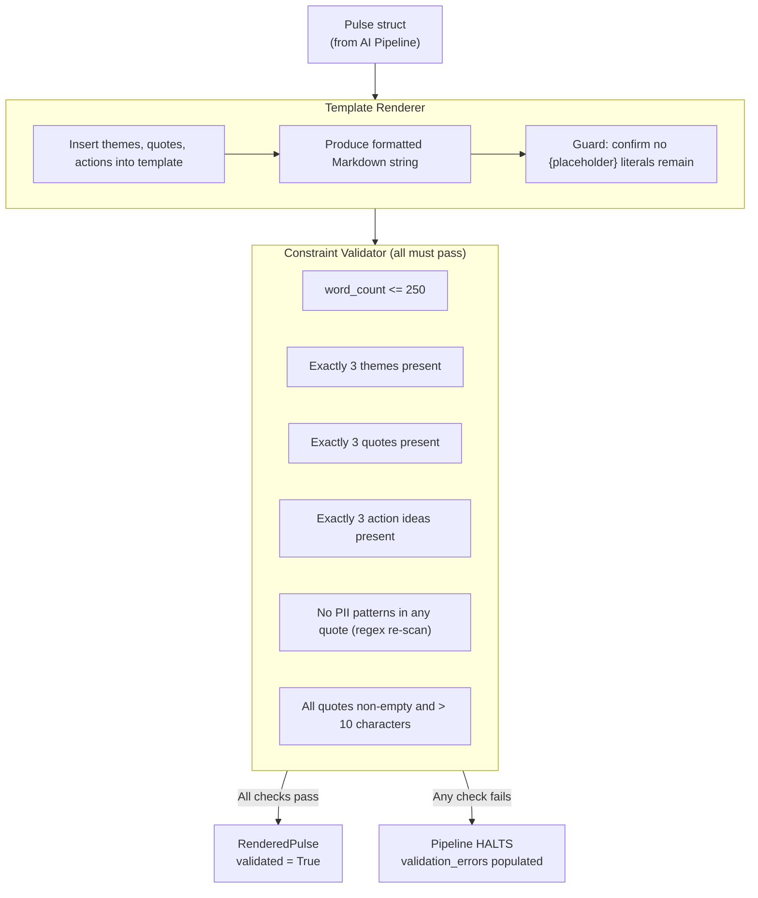
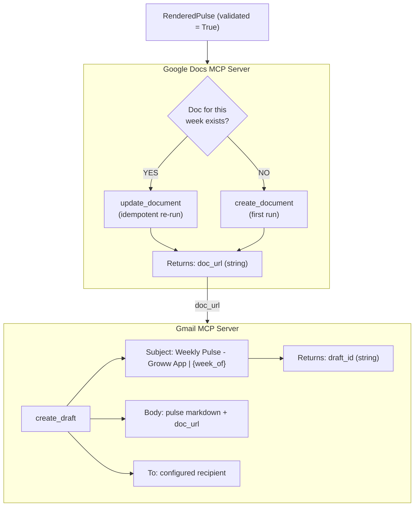
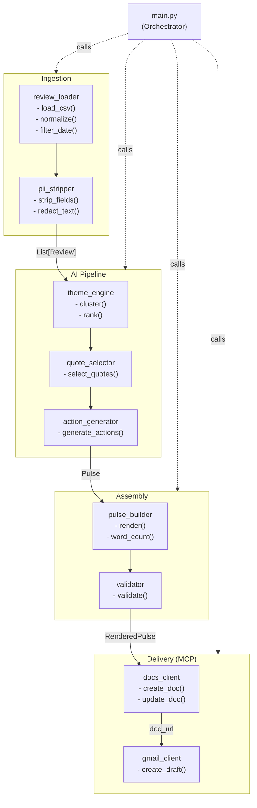
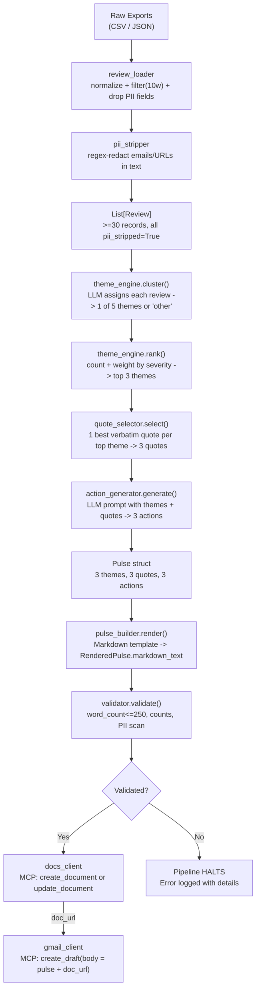

# Architecture - Weekly Pulse Review Agent

> **Project:** Groww App - Weekly Pulse Review
> **Last Updated:** 2026-07-27
> **Status:** Draft

---

## System Overview

The Weekly Pulse Review system is a **single-agent AI pipeline** that ingests raw app-store reviews, extracts signal through LLM-driven theme clustering, and delivers a structured weekly pulse through Google Docs and Gmail - both integrated exclusively via MCP (Model Context Protocol) servers.

The pipeline is **linear and sequential**: each layer produces a well-defined output contract that the next layer consumes. There is no shared mutable state across layers; data flows forward only.



**Design Principles:**
- **Privacy-first:** PII is removed at ingestion - the earliest possible point - before any data reaches the LLM or output artifacts.
- **MCP-exclusive delivery:** No Google REST API calls in application code. All Google Docs and Gmail interactions go through MCP tool calls.
- **Hard constraint validation:** Word count, theme count, and quote count are enforced as hard stops - not soft guidelines.
- **Configurable, not hardcoded:** Themes, lookback window, word limits, and LLM model are all driven from `settings.yaml`.

---

## Layer Breakdown

### Layer 1 - Data Ingestion

Responsible for sourcing raw review data from public app store exports, normalizing them to a unified internal schema, filtering by date, and stripping PII. This layer must complete successfully before any data reaches the AI pipeline.



**Responsibilities:**
- Load raw exports (CSV / JSON) from App Store and Play Store
- Map store-specific column names to the unified `Review` schema (column names differ between stores)
- Filter to the last 8-12 weeks by `date` (configurable via `lookback_weeks`)
- Strip PII fields and patterns before any downstream processing
- Handle malformed rows gracefully - skip with a logged warning rather than crashing

**Data Schema (`Review`):**
```json
{
  "id": "string",
  "source": "app_store | play_store",
  "rating": 1-5,
  "title": "string | null",
  "text": "string",
  "date": "ISO-8601",
  "pii_stripped": true
}
```

**PII Stripping Rules:**
| Field / Pattern | Action |
|-----------------|--------|
| `reviewer_name` / `display_name` column | Dropped from object entirely |
| Email addresses in `text` | Replaced with `[REDACTED]` |
| URLs that appear personally identifying | Replaced with `[LINK]` |
| Device model strings (if present) | Removed |
| `user_id` / `reviewer_id` fields | Dropped |

**Error Handling:**
- Unparseable date -> row skipped, warning logged with row index
- Missing required field (`text` or `rating`) -> row skipped
- Completely empty export file -> returns empty list, pipeline halts with a meaningful error
- File not found -> raises `FileNotFoundError` with a clear message
- Fewer than 30 reviews after date filtering -> raises `InsufficientDataError`; pipeline halts

**Configuration (`settings.yaml` keys used by this layer):**
```yaml
ingestion:
  lookback_weeks: 10          # 8-12 week window
  sources:
    - app_store
    - play_store
  date_field: "date"
  min_reviews_required: 30   # pipeline halts if fewer loaded
```

---

### Layer 2 - AI Pipeline

The core intelligence layer. Uses an LLM to cluster reviews into themes, rank themes by prevalence, select the best representative quotes, and generate concrete action ideas. All LLM calls go through the Google GenAI SDK; the model and parameters are configurable.



**Themes for Groww (configurable in `settings.yaml`):**
| Theme | Description | Typical Review Signals |
|-------|-------------|------------------------|
| `onboarding` | Account setup, KYC, first-use friction | "couldn't sign up", "app wouldn't let me start" |
| `KYC` | Document verification, identity checks | "PAN rejected", "video KYC failed" |
| `payments` | Deposits, withdrawals, payment failures | "SIP failed", "money deducted but not invested" |
| `statements` | Portfolio statements, tax documents | "can't download statement", "wrong P&L shown" |
| `withdrawals` | Fund redemption speed, failures | "withdrawal pending for 5 days", "money not received" |

**LLM Integration Details:**
| Setting | Value | Reason |
|---------|-------|--------|
| Model | `gemini-3.6-flash` (configurable) | Fast and cost-effective for classification |
| Temperature | `0.3` | Low for consistent, deterministic-leaning output |
| Max output tokens | `512` per call | Sufficient for classification + short generation |
| Batching | 20 reviews per clustering call | Reduces API calls; stays within context window |
| Retry policy | 3 retries with exponential backoff | Handles transient API errors gracefully |


**Model Quota Budget & Rate-Limiting Strategy:**
| Quota Metric | Tier Limit | Pipeline Target / Budget | Headroom |
|---|---|---|---|
| **Requests / Minute (RPM)** | 30 RPM | ~12–15 RPM (with 2.5s inter-batch delay) | 50% buffer |
| **Tokens / Minute (TPM)** | 12,000 TPM | ~8,400 TPM (25 reviews/batch * ~700 tokens) | 30% buffer |
| **Requests / Day (RPD)** | 1,000 RPD | ~42 requests per run (40 cluster + 1 summary + 1 actions) | 95.8% buffer |
| **Tokens / Day (TPD)** | 100,000 TPD | ~30,000 tokens per run (1,000 reviews) | 70% buffer |

**Data Reduction & Sampling (1,000 Reviews Cap):**
To stay strictly within the 100K TPD and 12K TPM constraints while preserving statistical significance:
1. **Cap**: Up to 1,000 normalized English reviews are processed per pipeline run (max_reviews_to_process: 1000).
2. **Stratified Sampling**: When >1,000 reviews are ingested, reviews are sampled across weeks and rating tiers (1-star vs 5-star) to preserve true signal distribution.
3. **Throttling**: A configurable pause of 2.5 seconds (
equest_delay_seconds: 2.5) is executed between consecutive clustering batch calls to prevent hitting the 30 RPM / 12K TPM ceilings.


**Pulse Data Contract:**
```python
@dataclass
class Theme:
    name: str
    review_count: int
    summary: str          # 1-2 sentence LLM-generated summary

@dataclass
class Pulse:
    top_themes: list[Theme]       # exactly 3
    quotes: list[str]             # exactly 3, verbatim, PII-clean
    action_ideas: list[str]       # exactly 3
    review_count: int             # total reviews processed this run
    week_of: date                 # ISO date of the week start (Monday)
```

---

### Layer 3 - Pulse Assembly & Validation

Takes the raw `Pulse` struct from Layer 2, renders it into formatted Markdown using a fixed template, and validates all hard constraints. Nothing reaches the delivery layer without passing this gate.



**Validation Rules:**
| Rule | Failure Behaviour |
|------|------------------|
| Word count <= 250 | Pipeline halts; error logged with actual count |
| Exactly 3 themes | Pipeline halts; validation error list populated |
| Exactly 3 quotes | Pipeline halts |
| Exactly 3 action ideas | Pipeline halts |
| No PII in any quote | Pipeline halts; flagged quote identified in error |
| All quotes > 10 characters | Pipeline halts |
| No `{placeholder}` text in rendered output | Pipeline halts (template rendering bug guard) |

**RenderedPulse contract:**
```python
@dataclass
class RenderedPulse:
    markdown_text: str
    word_count: int
    validated: bool
    validation_errors: list[str]   # empty if validated=True
```

**Pulse Document Template:**
```
# Weekly Pulse - Groww App
Week of: {week_of}   |   Reviews analysed: {review_count}

## Top Themes This Week
1. {theme_1} - {theme_1_summary}
2. {theme_2} - {theme_2_summary}
3. {theme_3} - {theme_3_summary}

## What Users Are Saying
> "{quote_1}"
> "{quote_2}"
> "{quote_3}"

## Recommended Actions
1. {action_1}
2. {action_2}
3. {action_3}
```

---

### Layer 4 - Delivery via MCP Servers

All external integrations go through MCP servers. No direct Google API calls are made anywhere in application code. The delivery layer only executes if a validated `RenderedPulse` is passed to it. Google Docs is written first; the Gmail draft always includes the resulting Doc URL.



**Idempotency Design:**
The `docs_client` checks whether a document titled `"Weekly Pulse - Groww App | {YYYY-WNN}"` already exists before calling `create_document`. If found, it calls `update_document` instead. This means the pipeline can be safely re-run in the same week without creating duplicate documents.

**Sequencing Constraint:**
Gmail draft creation always runs after the Google Doc step. If `create_document` fails, the Gmail step is skipped entirely - no draft is created with a broken or missing link.

**MCP Server Tool Reference:**
| MCP Server | Tool Name | Input | Output |
|------------|-----------|-------|--------|
| Google Docs | `create_document` | `title`, `content` (Markdown) | Google Doc URL |
| Google Docs | `update_document` | `document_id`, `content` | Updated Doc URL |
| Gmail | `create_draft` | `to`, `subject`, `body` | Draft ID |

**What MCP servers handle (application code does NOT):**
- OAuth 2.0 token acquisition and refresh
- HTTP retry logic for Google API calls
- Credential storage and rotation
- API version management

---

## Component Diagram



---

## Project Directory Structure

```
weekly-pulse-review/
|
+-- docs/
|   +-- ProblemStatement.md
|   +-- architecture.md          <- this file
|   +-- implementation-plan.md
|   +-- eval.md
|   +-- decision.md
|
+-- src/
|   +-- ingestion/
|   |   +-- review_loader.py     # Load & normalize raw exports
|   |   +-- pii_stripper.py      # Strip usernames, emails, IDs
|   |
|   +-- pipeline/
|   |   +-- theme_engine.py      # LLM-driven clustering & ranking
|   |   +-- quote_selector.py    # Pick representative quotes
|   |   +-- action_generator.py  # Generate action ideas via LLM
|   |
|   +-- assembly/
|   |   +-- pulse_builder.py     # Assembles + renders Pulse struct
|   |   +-- validator.py         # Hard constraint validation
|   |
|   +-- delivery/
|   |   +-- docs_client.py       # Google Docs via MCP
|   |   +-- gmail_client.py      # Gmail via MCP
|   |
|   +-- main.py                  # Orchestration entry point
|
+-- data/
|   +-- raw/                     # Raw exports (gitignored)
|   +-- processed/               # Normalized reviews (gitignored)
|
+-- config/
|   +-- settings.yaml            # All runtime config
|
+-- prompts/
|   +-- cluster_prompt.txt       # Theme clustering prompt template
|   +-- action_prompt.txt        # Action generation prompt template
|
+-- tests/
    +-- test_ingestion.py
    +-- test_pipeline.py
    +-- test_assembly.py
    +-- test_delivery.py
```

---

## Configuration System

All runtime-tunable values live in `config/settings.yaml`. Nothing is hardcoded in application code.

```yaml
ingestion:
  lookback_weeks: 10
  sources:
    - app_store
    - play_store
  min_reviews_required: 30

themes:
  allowed:
    - onboarding
    - KYC
    - payments
    - statements
    - withdrawals
  max_themes: 5
  top_n_to_surface: 3

llm:
  model: gemini-3.6-flash
  temperature: 0.3
  max_output_tokens: 512
  batch_size: 25
  request_delay_seconds: 2.5
  max_retries: 3

pulse:
  max_words: 250
  quotes_required: 3
  actions_required: 3

delivery:
  recipient_email: "you@example.com"
  doc_title_format: "Weekly Pulse - Groww App | {year}-W{week}"
  draft_subject_format: "Weekly Pulse - Groww App | Week of {week_date}"
```

---

## End-to-End Data Flow



---

## Security & Privacy Architecture

| Concern | Approach |
|---------|----------|
| **PII in reviews** | Stripped at ingestion before any LLM call or file write |
| **OAuth / credentials** | Handled entirely by MCP servers - never in app code |
| **Raw review data** | Stored only locally, gitignored, never logged to console |
| **LLM inputs** | Only anonymized text sent to LLM; no reviewer identity ever passed |
| **Output artifacts** | Secondary PII regex scan on quotes before inclusion in pulse |
| **Prompt injection** | Review text is wrapped in a structured prompt; not string-concatenated unsafely |
| **Secrets** | No API keys or tokens stored in source code or config files |

---

## Pipeline Failure Modes & Handling

| Failure | Where It Occurs | Handling Strategy |
|---------|-----------------|-------------------|
| Export file not found | Ingestion | `FileNotFoundError` with path; pipeline stops |
| Fewer than 30 reviews loaded | Ingestion | `InsufficientDataError`; pipeline stops with clear message |
| LLM API timeout / rate limit | Theme clustering | Retry up to 3x with exponential backoff; fail if all exhausted |
| All reviews fall into "other" | Ranking | `NoThemesDetectedError`; suggests revisiting theme config |
| Word count > 250 after generation | Validation | `validated=False`; pipeline stops; error logged with actual count |
| MCP server unreachable | Delivery | `MCPConnectionError`; delivery layer stops cleanly |
| Doc creation fails | Delivery | Exception surfaced; Gmail step is skipped entirely |
| `update_document` called but doc not found | Delivery | Falls back to `create_document` automatically |